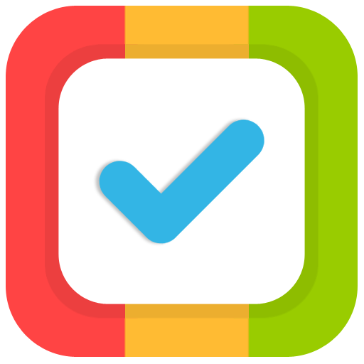

<a name="readme-top"></a>
<!-- PROJECT SHIELDS -->
<!--
*** I'm using markdown "reference style" links for readability.
*** Reference links are enclosed in brackets [ ] instead of parentheses ( ).
*** See the bottom of this document for the declaration of the reference variables
*** for contributors-url, forks-url, etc. This is an optional, concise syntax you may use.
*** https://www.markdownguide.org/basic-syntax/#reference-style-links
-->
<div align="center">
	
[![Contributors][contributors-shield]][contributors-url]
[![Forks][forks-shield]][forks-url]
[![Stargazers][stars-shield]][stars-url]
[![Issues][issues-shield]][issues-url]
[![MIT License][license-shield]][license-url]
[![LinkedIn][linkedin-shield]][linkedin-url]

</div>
<br />
<div align="center">
  <a href="https://github.com/zdienos/help-it">
    
  </a>

  <h3 align="center">helpIT</h3>

  <p align="center">
    Aplikasi untuk membantu pekerjaan divisi IT
    <br />
    <br />
    <a href="https://github.com/othneildrew/Best-README-Template"><strong>Explore the docs »</strong></a>
    <br />
    <br />
    <a href="https://github.com/othneildrew/Best-README-Template">View Demo</a>
    ·
    <a href="https://github.com/othneildrew/Best-README-Template/issues">Report Bug</a>
    ·
    <a href="https://github.com/othneildrew/Best-README-Template/issues">Request Feature</a>
  </p>
</div>


<!-- TABLE OF CONTENTS -->
<details>
  <summary>Table of Contents</summary>
  <ol>
    <li>
      <a href="#about">About</a>
    </li>
    <li>
      <a href="#getting-started">Getting Started</a>
      <ul>
        <li><a href="#prerequisites">Prerequisites</a></li>
        <li><a href="#installing">Installing</a></li>
      </ul>
    </li>
    <li><a href="#usage">Usage</a></li>
    <li><a href="#roadmap">Roadmap</a></li>
     <li><a href="#builtwith">Built With</a></li>	  
    <li><a href="#contributing">Contributing</a></li>
    <li><a href="#license">License</a></li>
    <li><a href="#contact">Contact</a></li>
    <li><a href="#acknowledgments">Acknowledgments</a></li>
  </ol>
</details>

## About
Merupakan aplikasi web berbasis codeigniter untuk keperluan manajemen pekerjaan (work order) khususnya bidang IT.
Masih versi awal, digunakan agar antar team/karyawan, bisa saling mengetahui pekerjaan baru apa saja yang diinginkan oleh departemen lain (atau bisa departemen sendiri). Kemudian melihat juga pekerjaan yang sementara dikerjakan (atau on progress). Cukup membantulah, dibanding harus menulis-nulis di whiteboard. 
Awalnya diprivate, tetapi karena sudah tidak digunakan, mending dibuat public saja. Siapa tau berguna.


## Getting Started

Beberapa hal yang perlu kamu persiapkan agar bisa menjalankan web apps ini.


### Prerequisites

Cuma butuh komputer :D

```
Apache/Ngix Server
PHP
MySQL
```

### Installing

Edit file database.php, sesuaikan dengan kondisi komputer/server Anda.

```
'hostname' => 'localhost',
'username' => 'root',
'password' => 'biasanya_sih_kosong',
'database' => 'help-it',
```

Buat database help-it, kemudian import database 
```
help-it.sql
```
<p align="right">(<a href="#readme-top">back to top</a>)</p>


<!-- ROADMAP -->
## Roadmap

- [x] Ubah dari private repository menjadi public
- [ ] Update ke Codeigniter versi 3.1.13
- [ ] Ganti template menggunakan CoreUI
- [ ] Selesaikan fitur yang belum direalisasikan
- [ ] Cari Sponsor???
      
Lihat [daftar issues](https://github.com/zdienos/help-it/issues) untuk penambahan fitur atau issues.

  
## BuiltWith

* 
* 
* 
* 
* 

<p align="right">(<a href="#readme-top">back to top</a>)</p>


<!-- CONTRIBUTING -->
## Contributing

Contributions are what make the open source community such an amazing place to learn, inspire, and create. Any contributions you make are **greatly appreciated**.

If you have a suggestion that would make this better, please fork the repo and create a pull request. You can also simply open an issue with the tag "enhancement".
Don't forget to give the project a star! Thanks again!

1. Fork the Project
2. Create your Feature Branch (`git checkout -b feature/AmazingFeature`)
3. Commit your Changes (`git commit -m 'Add some AmazingFeature'`)
4. Push to the Branch (`git push origin feature/AmazingFeature`)
5. Open a Pull Request

<p align="right">(<a href="#readme-top">back to top</a>)</p>


<!-- LICENSE -->
## License

Distributed under the MIT License. See `LICENSE.txt` for more information.

<p align="right">(<a href="#readme-top">back to top</a>)</p>


<!-- CONTACT -->
## Contact

Mardino Santosa- [@zdienos](https://twitter.com/zdienos) - [website](https://zdienos.com)

Project Link: [https://github.com/zdienos/help-it](https://github.com/zdienos/help-it)


<p align="right">(<a href="#readme-top">back to top</a>)</p>

<!-- MARKDOWN LINKS & IMAGES -->
<!-- https://www.markdownguide.org/basic-syntax/#reference-style-links -->
[contributors-shield]: https://img.shields.io/github/contributors/zdienos/help-it.svg?style=for-the-badge
[contributors-url]: https://github.com/zdienos/help-it/graphs/contributors
[forks-shield]: https://img.shields.io/github/forks/zdienos/help-it.svg?style=for-the-badge
[forks-url]: https://github.com/zdienos/help-it/network/members
[stars-shield]: https://img.shields.io/github/stars/zdienos/help-it.svg?style=for-the-badge
[stars-url]: https://github.com/zdienos/help-it/stargazers
[issues-shield]: https://img.shields.io/github/issues/zdienos/help-it.svg?style=for-the-badge
[issues-url]: https://github.com/zdienos/help-it/issues
[license-shield]: https://img.shields.io/github/license/zdienos/help-it.svg?style=for-the-badge
[license-url]: https://github.com/zdienos/help-it/blob/master/LICENSE.txt
[linkedin-shield]: https://img.shields.io/badge/-LinkedIn-black.svg?style=for-the-badge&logo=linkedin&colorB=555
[linkedin-url]: https://linkedin.com/in/zdienos

